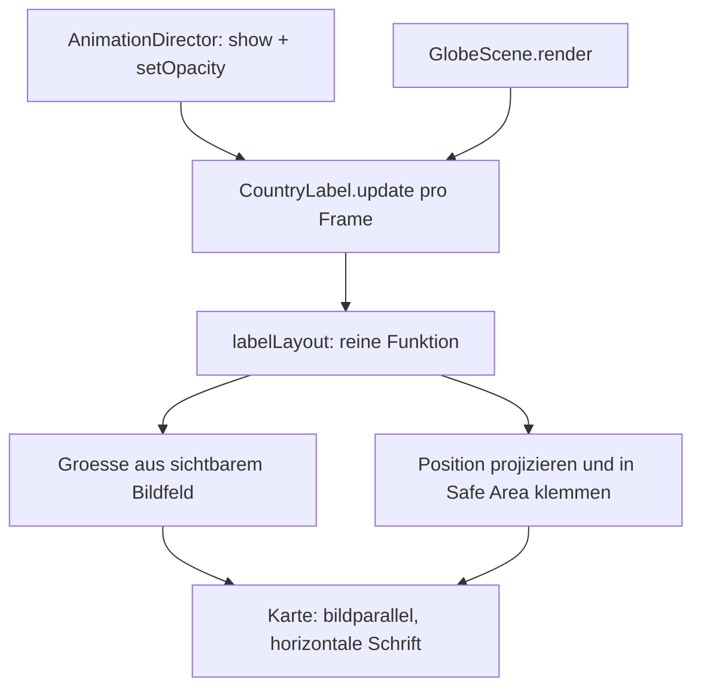

# Plan: Länderlabel als Billboard darstellen

## Ausgangslage und Befund

Das Label ist eine Canvas-Textur auf einer Ebene im 3D-Raum ([`CountryLabel.ts`](../src/scene/CountryLabel.ts:1)). Zwei Fehler sind belegt:

1. **Falsche Drehung.** [`show()`](../src/scene/CountryLabel.ts:133) richtet die Ebene mit `setFromUnitVectors(PLANE_FACING, anchor)` aus. Diese Funktion liefert die *kürzeste* Drehung und damit eine **beliebige Rollung** – die Karte steht schief.
2. **Falsche Größe.** [`Zeile 135`](../src/scene/CountryLabel.ts:135) skaliert die Karte mit `0.62 + angularRadius * 1.9`, also bis **1,9 Welteinheiten**. Bei Deutschlands Zoomabstand (2,84) ist die sichtbare Bildhöhe nur `2 · 2,84 · tan(21°) ≈ 2,18` Einheiten. Die Karte füllt damit fast das ganze Bild und ragt durch den Nord-Versatz und `lift` zusätzlich über den Rand hinaus.

Beides zusammen ergibt das im Foto sichtbare Bild: übergroß und schief.

## Ziel

Eine Karte, die am Land verankert bleibt, aber:

- **immer horizontal** steht (bessere Lesbarkeit),
- **immer vollständig in den Rahmen** passt (Safe Area),
- eine **feste, lesbare Bildgröße** hat, unabhängig davon, ob das Land klein oder groß ist.

## Entscheidung

**Billboard im 3D-Raum.** Die Karte bleibt räumlich am Land verankert, wird aber zur Kamera ausgerichtet. Damit bleibt die dokumentierte Eigenschaft erhalten, kein flaches HUD zu sein – die Ausrichtung ist jetzt nur bildparallel statt tangential.

## Wichtige Vereinfachung

[`CameraRig.apply()`](../src/scene/CameraRig.ts:44) setzt die Kamera auf `(0, offsetY, distance)` und ruft `lookAt(0, 0, 0)` mit Standard-`up` auf. Die Kamera hat damit **keine Rollung**. Eine Karte mit der Identitätsdrehung ist also automatisch horizontal und blickt die Kamera an. Die aufwendige Basis-Konstruktion entfällt.

Daraus folgt eine **strukturelle Änderung**: Die Karte darf kein Kind der rotierenden Globus-Gruppe mehr sein, sonst erbt sie deren Drehung. Sie wird ein Kind der Szene; ihre Weltposition wird pro Frame aus der Globus-Drehung berechnet.

## Aufbau

## Rechenschritte pro Frame

1. **Weltrichtung des Landes**: `dir` (aus lat/lon, einmal beim `show()` berechnet) wird mit der Globus-Drehung rotiert.
2. **Kartenradius**: fester Faktor über der Kugel (`GLOBE_RADIUS * labelRadiusFactor`), nur noch für die Tiefe relevant.
3. **Größe aus dem sichtbaren Bildfeld** an der Kartentiefe:
   - `visibleH = 2 · d · tan(fov/2)`, `visibleW = visibleH · aspect`
   - `width = min(visibleW · widthFraction[format], visibleH · maxHeightFraction · CARD_ASPECT)`
   - Die Karte hat damit **konstante Bildgröße**, unabhängig von `angularRadius`.
4. **Position**: Landesmittelpunkt projizieren, um einen festen Bildversatz **nach oben** verschieben (damit die Karte das Land nicht verdeckt), dann in die Safe Area klemmen.
5. **Rückrechnung** des geklemmten Bildversatzes in eine Weltverschiebung entlang der Kameraachsen (die Karte liegt bildparallel, daher genügt eine Verschiebung in der Kameralebene).
6. **Klemmen**: erlaubter Mittelpunkt ist `|ndc| ≤ 1 − safeAreaInset − halbeAusdehnung`, damit die Karte samt ihrer Ausdehnung im Rahmen bleibt.

Der Schritt läuft **nur, solange das Label sichtbar ist**. Kosten: wenige Vektoroperationen und eine Projektion pro Frame – vernachlässigbar.

## Testbarkeit

Die Rechnung wandert in ein reines Modul [`src/scene/labelLayout.ts`](../src/scene/labelLayout.ts:1) ohne three.js-Szenenzustand. Damit ist sie **headless prüfbar** und wird Teil des Smoke-Tests:

- Karte bleibt für beide Formate und viele Länderradien in der Safe Area,
- Seitenverhältnis bleibt erhalten,
- Größe ist unabhängig von `angularRadius` konstant,
- Größe überschreitet nie die Höhen- und Breitengrenze.

## Betroffene Dateien

| Datei | Änderung |
| --- | --- |
| [`src/config.ts`](../src/config.ts:90) | `LABEL` um Anteile je Format, Bildversatz, Radiusfaktor erweitern |
| [`src/scene/labelLayout.ts`](../src/scene/labelLayout.ts:1) | neu: reine Layout-Rechnung |
| [`src/scene/CountryLabel.ts`](../src/scene/CountryLabel.ts:1) | bildparallele Ausrichtung, `update()`, `dispose()`, kein `angularRadius`-Scaling |
| [`src/scene/GlobeScene.ts`](../src/scene/GlobeScene.ts:1) | Label an die Szene hängen, `update()` im Renderloop aufrufen |
| [`src/geography/orientation.ts`](../src/geography/orientation.ts:36) | `labelAnchor` wird unbenutzt und entfernt |
| [`scripts/smoke.ts`](../scripts/smoke.ts:1) | Layout-Prüfungen ergänzen |
| [`README.md`](../README.md:236), [`docs/architecture.md`](../docs/architecture.md:113), [`docs/verifikation.md`](../docs/verifikation.md:1) | Aussagen zur Label-Darstellung korrigieren |

## Risiken

- **Verdeckung am Kartenrand.** Liegt die geklemmte Karte über dem Rand der Kugel, schwebt sie über dem Hintergrund. Das ist für eine Beschriftung gewollt, sollte aber visuell abgenommen werden.
- **Tiefenlage.** Der Radiusfaktor muss klein bleiben, sonst wirkt die Karte abgehoben (Parallaxe). Die Größe ist davon entkoppelt, deshalb ist nur die Optik betroffen.
- **Dokumentierte Abweichung.** Die Aussage „nicht als flaches HUD" gilt weiterhin räumlich, aber nicht mehr in der Ausrichtung. Beide Dokumente müssen das ausdrücklich festhalten.